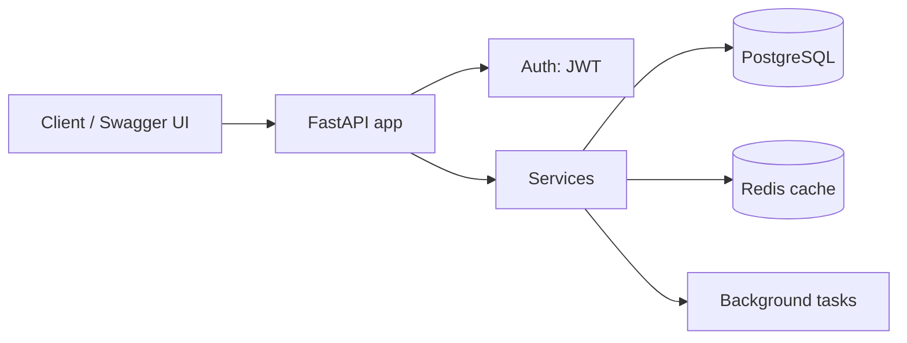

# 2-Week Backend Development Implementation Plan

*As of 2026-09-24 · Ryan Kho*

## Goal and honest expectations

In 14 days you will not "master" backend development — nobody does. What you *can* reach is **independent competence**: design, build, test and deploy a real REST API with a database, authentication and a public URL, using AI as a fast pair-programmer rather than a crutch. That is the level of a solid intern or junior developer, and it is enough to build hackathon backends and side projects on your own.

The plan assumes about **6–8 hours per day**, alongside or outside semester load. If you only have 3–4 hours a day, stretch it to 4 weeks with the same order; do not skip days.

By Day 14 you should be able to do all of these without copying a tutorial:

- Explain what happens between a browser click and a database row being saved
- Design a database schema and REST endpoints for a new idea on paper in 30 minutes
- Build CRUD endpoints with validation, error handling and pagination
- Add signup/login with hashed passwords and JWT tokens, plus per-user permissions
- Write automated tests and run them in CI
- Package the app in Docker and deploy it to a public URL
- Read AI-generated code, spot what is wrong, and fix it

## Tech stack and setup

Use **Python + FastAPI + PostgreSQL**. You already write Python for your AI courses, FastAPI is the standard for serving ML models, it generates interactive API docs automatically, and its type hints make AI-generated code easier to check. The concepts (HTTP, SQL, auth, testing, Docker) transfer 1:1 to Node/Express, Go or Java later.

| Layer | Tool | Why this one |
| --- | --- | --- |
| Language | Python 3.12+ | Already familiar; dominant in AI |
| Web framework | FastAPI | Async, typed, auto docs at `/docs` |
| Validation | Pydantic v2 | Request/response schemas |
| Database | PostgreSQL 16 | Industry default relational DB |
| ORM + migrations | SQLAlchemy 2.0 + Alembic | Most common Python data layer |
| Auth | passlib/bcrypt + PyJWT | Password hashing and tokens |
| Testing | pytest + httpx TestClient | Standard Python testing |
| Cache / queue | Redis | Caching, rate limiting, background jobs |
| Packaging | Docker + Docker Compose | Same environment everywhere |
| Deploy | Render, Railway or Fly.io | Free/cheap tier, deploys from GitHub |
| API client | Bruno, Postman or `curl` | Manually hit endpoints |

**Day 0 setup checklist (evening before Day 1, ~2 hours):**

- [x] Install Python 3.12+, VS Code (Python + Ruff extensions), Git
- [x] Install Docker Desktop (enable WSL2 on Windows) and confirm `docker run hello-world` works
- [x] Create a GitHub repo `backend-14days`; one folder per day
- [x] Install an API client (Bruno or Postman)
- [x] Set up your AI assistant in the editor (Claude Code, Copilot or similar) — but read the AI rules below first

## Rules for learning with AI

The goal is to be the **architect and reviewer**, with AI as the typist. Juniors who let AI drive end up with backends they cannot debug. These five rules prevent that.

1. **Morning = no AI code generation.** Learn the day's concept by reading docs and typing examples yourself. Ask AI only to *explain* (e.g. "why does this return 422?"), never to write.
2. **Afternoon = AI as pair-programmer.** Describe the design first (endpoint, schema, expected behaviour), then let AI draft. You must be able to explain every line before you commit it.
3. **Spec before prompt.** Write a 5-line spec in a comment: inputs, outputs, errors, edge cases. Paste that as the prompt. Vague prompts produce plausible-looking wrong code.
4. **Verify, do not trust.** Run it, test it, and ask AI "what are the security problems in this code?" Common AI mistakes in backends: SQL built with f-strings, missing auth checks on update/delete, secrets hard-coded, N+1 queries, no input limits.
5. **Break it on purpose.** Once a day, delete or change something and predict the error before running. This builds the debugging instinct that AI cannot give you.

**Good prompt pattern:** "I'm building `POST /tasks` in FastAPI with SQLAlchemy 2.0. Schema: … Rules: only the owner can create tasks in their project; return 404 if the project doesn't exist or isn't theirs. Write the route and a pytest for the forbidden case. Explain any design choice you make."

## Week 1 — Fundamentals

Week 1 builds one small project, a **Notes API**, layer by layer. Each day ends with a working commit and a deliverable you can demo.

| Day | Topic | Learn (morning, no AI codegen) | Build (afternoon, AI allowed) | Done when |
| --- | --- | --- | --- | --- |
| 1 | How the web works + Git | Client/server, DNS, TCP vs HTTP, request/response anatomy, methods, status codes, headers, JSON. Terminal basics, Git commit/branch/push | Use `curl` and your API client against a public API (e.g. GitHub API). Write a raw Python `http.server` that returns JSON | You can explain every line of a raw HTTP request and response |
| 2 | First API with FastAPI | Routing, path vs query params, request body, Pydantic models, status codes, auto docs at `/docs` | Notes API with in-memory list: `GET/POST/PUT/DELETE /notes` | All 5 CRUD endpoints work in `/docs`, correct status codes (201, 404, 422) |
| 3 | REST design + project structure | Resource naming, idempotency, PUT vs PATCH, pagination, filtering, error response format; routers, schemas, services layout | Refactor into `routers/`, `schemas/`, `services/`; add pagination + search; consistent error JSON | You can design endpoints for a new idea on paper before coding |
| 4 | SQL and databases | Tables, primary/foreign keys, one-to-many, many-to-many, `SELECT/JOIN/GROUP BY`, indexes, normalization, transactions (ACID) | Run Postgres in Docker; write raw SQL for a users–notes–tags schema; solve 20 SQL exercises | You can write a 3-table JOIN by hand and explain why an index helps |
| 5 | ORM + migrations | SQLAlchemy 2.0 models, sessions, relationships, dependency injection (`Depends`), Alembic migrations, SQL injection and why ORMs/params prevent it | Replace the in-memory list with Postgres; first Alembic migration; add tags (many-to-many) | Data survives a restart; migration history is clean |
| 6 | Authentication + authorization | Hashing vs encryption, bcrypt, sessions vs JWT, access/refresh tokens, OAuth2 password flow, CORS, authN vs authZ | Signup/login, `get_current_user` dependency, each user sees only their own notes | Another user's note returns 404; passwords never stored in plain text |
| 7 | Testing + review day | pytest, fixtures, test database, unit vs integration tests, arrange-act-assert | Write 15+ tests (happy paths, auth failures, validation). Ask AI to review the whole repo for bugs and security issues, then fix them yourself | `pytest` green; you can explain every fix |

**Week 1 checkpoint (end of Day 7):** without notes, draw the request flow of `POST /notes` from client → router → dependency (auth) → service → ORM → Postgres → response. If you can't, repeat the weak day on Day 8 morning.

## Week 2 — Production skills and the capstone

Week 2 starts a **fresh capstone repo** (spec below) so you prove you can build from zero. Mornings still cover one new concept; afternoons apply it to the capstone.

| Day | Topic | Learn (morning) | Build on capstone (afternoon) | Done when |
| --- | --- | --- | --- | --- |
| 8 | System design on paper | Requirements → entities → ERD → endpoint list; stateless servers; how a real system looks (load balancer, app servers, DB, cache) | Write the capstone design doc: ERD, endpoint table, auth rules. Ask AI to critique it, then decide yourself | Design doc committed before any code |
| 9 | Scaffold from scratch | Config via env vars (`pydantic-settings`), `.env` vs secrets, logging, structured errors | Project skeleton, Docker Compose (API + Postgres), models, migrations, auth — with AI drafting, you reviewing | `docker compose up` runs the whole stack |
| 10 | Core business logic | Transactions, race conditions, soft deletes, role-based access (owner/member), N+1 queries and `selectinload` | All core CRUD + permission rules + pagination/filtering | Every endpoint in the design doc exists and is tested |
| 11 | Performance + async work | Redis caching, rate limiting, background tasks (FastAPI `BackgroundTasks` or a worker), async I/O basics, query `EXPLAIN` | Cache a hot read endpoint, rate-limit login, send a background "email" (log it) on invite | You can show a before/after timing for the cached endpoint |
| 12 | Security + files + integrations | OWASP API Top 10, input limits, CORS, secrets handling; calling a 3rd-party API; file uploads | Run a security pass (checklist + AI review); add file upload or one external API call; optional: an endpoint that calls an LLM API | No secrets in Git; broken-auth tests pass |
| 13 | Deploy + CI/CD | Dockerfile best practices, environment config, GitHub Actions, health checks, logs in production, managed Postgres | GitHub Actions runs tests on push; deploy to Render/Railway/Fly.io with managed Postgres | Public URL works; a failing test blocks deploy |
| 14 | Polish + solo build test | Writing a README, API docs, reading your own logs | Morning: finish README + demo. Afternoon: **solo test** — build a brand-new mini API (e.g. URL shortener) in 3 hours with AI, from spec to deploy | Capstone live + mini API built in ≤ 3 h |

If you fall behind, cut Day 11's Redis work and Day 12's integrations first. Never cut testing, auth or deployment.

## Capstone: Team Task Manager API

The capstone is a **multi-user team task manager** (like a mini Trello/Asana backend). It is small enough for 6 days but forces every core skill: relations, permissions, auth, caching and deployment.

Requests pass through JWT auth, then a service layer that owns all business rules and talks to Postgres and Redis.

**Entities:** User, Workspace, Membership (user–workspace with role `owner` or `member`), Project, Task (title, status, priority, due date, assignee), Comment.

**Acceptance criteria:**

- [ ] Signup, login, refresh token; passwords hashed with bcrypt
- [ ] Owners can invite members; only owners can delete a workspace or project
- [ ] Tasks support filter by status/assignee, sort by due date, and pagination
- [ ] Users can never read or change data in a workspace they don't belong to (tested)
- [ ] Workspace dashboard endpoint (task counts by status) is cached in Redis
- [ ] Login is rate-limited (e.g. 5 attempts/minute per IP)
- [ ] 30+ pytest tests, run in GitHub Actions on every push
- [ ] Runs locally with one `docker compose up`
- [ ] Deployed to a public URL with managed Postgres
- [ ] README with setup steps, ERD, endpoint list and design decisions

**Stretch:** WebSocket notifications when a task is assigned, or an `/tasks/summarize` endpoint that calls an LLM API — a good bridge to your AI degree.

## Daily routine

Each day follows the same 7-hour rhythm so the only decision is *what*, never *how*.

| Block | Time | What you do |
| --- | --- | --- |
| Warm-up | 15 min | Explain yesterday's concept out loud or in a 5-line note, without looking |
| Learn | 2 h | Official docs + typing examples by hand; AI only to explain |
| Break | 30 min | Away from the screen |
| Build | 3 h | Day's deliverable with AI as pair-programmer; commit every 30–60 min |
| Break-it | 30 min | Introduce a bug, predict the error, fix it; read one error log fully |
| Review | 30 min | Ask AI to review the day's diff; fix issues yourself; write a 3-line learning log in `LOG.md` |

Keep `LOG.md` honest: what worked, what confused you, and one question to answer tomorrow. It becomes your revision notes and interview material.

## Day 14 self-assessment

Tick these honestly on Day 14. Eight or more ticks means you can build a backend alone with AI; fewer means repeat the weakest days before moving on.

- [ ] I can explain the difference between 401 and 403, and between PUT and PATCH
- [ ] I can design a normalized schema with a many-to-many relation on paper
- [ ] I can write a JOIN with GROUP BY without looking it up
- [ ] I can explain why passwords are hashed, not encrypted, and how a JWT is verified
- [ ] I can find and fix an N+1 query or a missing index
- [ ] I can spot at least 3 security bugs in AI-generated backend code
- [ ] I can write a failing test before fixing a bug
- [ ] I can read a stack trace and locate the failing line in under 5 minutes
- [ ] I can write a Dockerfile and Compose file from memory
- [ ] I built the Day 14 mini API from spec to deploy in 3 hours

## Resources

Stick to official docs first; they are more accurate than most tutorials and than AI on version-specific details.

| Topic | Resource | Use on |
| --- | --- | --- |
| HTTP | [MDN: An overview of HTTP](https://developer.mozilla.org/en-US/docs/Web/HTTP/Overview) | Day 1 |
| Git | [Pro Git book, ch. 1–3](https://git-scm.com/book/en/v2) | Day 1 |
| FastAPI | [FastAPI Tutorial – User Guide](https://fastapi.tiangolo.com/tutorial/) | Days 2–6 |
| SQL practice | [SQLBolt](https://sqlbolt.com/) and [PostgreSQL Exercises](https://pgexercises.com/) | Day 4 |
| ORM | [SQLAlchemy 2.0 Unified Tutorial](https://docs.sqlalchemy.org/en/20/tutorial/) | Day 5 |
| Migrations | [Alembic tutorial](https://alembic.sqlalchemy.org/en/latest/tutorial.html) | Day 5 |
| Testing | [pytest docs: Get started](https://docs.pytest.org/en/stable/getting-started.html) | Day 7 |
| Docker | [Docker: Get started](https://docs.docker.com/get-started/) | Days 4, 9, 13 |
| Security | [OWASP API Security Top 10](https://owasp.org/API-Security/) | Day 12 |
| CI | [GitHub Actions: Building and testing Python](https://docs.github.com/en/actions/use-cases-and-examples/building-and-testing/building-and-testing-python) | Day 13 |
| System design | [System Design Primer](https://github.com/donnemartin/system-design-primer) | Day 8, later |

## After the 2 weeks

Competence comes from the next 2–3 months of building, not from the 14 days. Build one new backend every 2–3 weeks, each adding one new skill:

1. **Weeks 3–5:** backend for your next hackathon or a real use (e.g. a Kuching bus-route API) — practise designing under time pressure
2. **Weeks 6–8:** serve one of your own ML models behind FastAPI with a job queue (Celery or RQ) — connects directly to your AI degree
3. **Weeks 9–12:** learn a second backend language (Node/TypeScript or Go) by rebuilding the capstone; you will notice the concepts are identical

Along the way, read *Designing Data-Intensive Applications* (Kleppmann) one chapter a week — it's the book that turns API builders into backend engineers.
