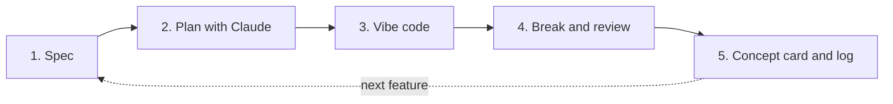

# Vibe-Coding Backend Plan — 4 Weeks

*Ryan Kho · Python + FastAPI · Claude Code · ~3–4 h/day · started Oct 2026*

## North star

Build real backends by **vibe coding with Claude Code**, while thinking like the engineer who is accountable for them.

I don't memorize syntax or master every tool. I want to:

1. **Ship.** Go from an idea to a deployed, working backend fast, with Claude Code writing most of the code.
2. **Judge.** Own the decisions AI won't make for me: requirements, architecture, restrictions, concurrency, robustness, maintainability.
3. **Navigate.** Know which tools and concepts exist (RAG, MCP, n8n, queues, …), what problem each one solves, and when to reach for it, without deep-diving until a project needs it.

**Principle:** I own the *what, why and when*. Claude Code handles the *how*. I verify everything before it ships.

---

## Depth levels

Not everything deserves the same depth. Each concept in this plan is tagged with one of three levels:

| Level | Meaning | Proof I've got it |
| --- | --- | --- |
| **Aware** | I know it exists, what it's for, and when I'd pick it | A concept card in `concepts/` |
| **Apply** | I've used it in a project with AI and can explain the design | It runs in one of my projects, and I can explain why it's there |
| **Deep** | I can spot when AI gets it wrong | I've broken it on purpose and fixed it myself |

**Deep is reserved for three areas:** concurrency, security and data modelling. In these areas AI code looks right, passes simple tests, and fails under real load or real attackers.

---

## The project loop

Every project follows the same five-step loop:



1. **Spec (me, no AI writing):** write `SPEC.md` with the goal, users, requirements, constraints, non-goals and a data model sketch. AI may critique it but not write it.
2. **Plan (with Claude):** have Claude Code propose an architecture and a step plan in plan mode. I accept, edit or reject it before any code is written.
3. **Vibe code:** Claude Code implements in small steps. I commit after each working slice.
4. **Break and review:** run tests, load tests and attack scenarios, and ask Claude to review its own code against the seven lenses below. I fix what matters.
5. **Card and log:** write or update a concept card for anything new, plus three lines in `LOG.md`.

### Seven engineering lenses (every project answers these in its README)

| Lens | Question I must answer |
| --- | --- |
| Requirements and constraints | What must it do, for whom, at what scale, cost and latency? What is explicitly out of scope? |
| Architecture | What are the components, how do they talk, and why this shape? |
| Restrictions | What must never happen? (e.g. a user reads another user's data, double charging) How is it enforced? |
| Concurrency | What happens when two requests hit the same data at the same moment? |
| Deadlocks and contention | Can anything wait on something that waits on it? Where are the locks and timeouts? |
| Robustness | What happens when the DB, LLM or third-party API is slow, down or returns garbage? |
| Maintainability | Could I (or a teammate) change this in three months? Structure, types, tests, docs. |

---

## Stack (free-first)

| Layer | Default choice | Notes |
| --- | --- | --- |
| Language and framework | Python 3.12 + FastAPI + Pydantic v2 | Typed, auto docs at `/docs`, best ecosystem for AI |
| AI coding | Claude Code | `CLAUDE.md` rules, plan mode, small commits |
| Database | PostgreSQL (local Docker, then Neon or Supabase free tier) | Supabase/Postgres also gives you **pgvector** for RAG |
| ORM and migrations | SQLAlchemy 2.0 + Alembic | |
| Cache and queue | Redis (local Docker or Upstash free tier) | Caching, rate limits, locks, job queue |
| Background jobs | FastAPI `BackgroundTasks`, then ARQ or Celery | |
| LLM | Gemini API free tier, or Ollama locally; Claude/OpenAI if credits are available | Wrap behind one interface so providers are swappable |
| Automation | n8n (self-hosted via Docker, free) | |
| Testing | pytest, httpx, Locust (load testing) | |
| Observability | Structured logging + Sentry free tier | |
| Deploy | Docker + Render free tier (or Railway/Fly.io trial) | GitHub Actions for CI |

---

## Repo layout

```
backend-14days/
├── IMPLEMENTATION_PLAN.md   ← this file
├── README.md                ← AI usage rules
├── CLAUDE.md                ← rules Claude Code follows in this repo (created in P0)
├── LOG.md                   ← 3 lines per session
├── concepts/                ← one concept card per idea (rag.md, mcp.md, deadlocks.md, …)
└── projects/
    ├── p0-warmup/
    ├── p1-hackathon-starter/
    ├── p2-ticket-rush/
    ├── p3-study-buddy-rag/
    ├── p4-mcp-server/
    ├── p5-n8n-automation/
    └── p6-capstone/
```

---

## Roadmap (28 sessions × 3–4 h)

| Week | Days | Project | Theme | Main concepts (level) |
| --- | --- | --- | --- | --- |
| 1 | 1–2 | P0 Warm-up | Toolchain and how the web works | HTTP, REST, JSON, status codes, env vars, Git flow (Apply) |
| 1 | 3–7 | P1 Hackathon Starter Kit | A reusable backend template | Spec/PRD, layered architecture, ORM and migrations, JWT auth, validation, Docker, pytest (Apply); data modelling (Deep) |
| 2 | 8–12 | P2 Ticket Rush | Concurrency and robustness | Race conditions, transactions, row locks, deadlocks, idempotency, rate limiting, Redis, retries, load testing (Deep) |
| 3 | 13–17 | P3 Study Buddy | RAG over my UTM lecture notes | Embeddings, chunking, pgvector, retrieval, streaming (SSE), LLM gateway, prompt injection, evals, cost control (Apply) |
| 3 | 18–19 | P4 MCP Server | Expose my backend as AI tools | MCP, tool calling, agents (Apply) |
| 4 | 20–22 | P5 Automation | n8n wired to my APIs | Webhooks, HMAC signatures, cron, event-driven design, queues (Apply) |
| 4 | 23–26 | P6 Capstone | Combine and ship one product | CI/CD, observability, deployment, ADRs, docs (Apply); security review (Deep) |
| 4 | 27–28 | Solo hackathon test | Blank repo → deployed app | Everything, under time pressure |

If I fall behind: cut P4 down to one tool, and shrink P5 to a single workflow. **Never cut** P2's break-and-fix work, security review or deployment.

---

## Project details

### P0 — Warm-up (Days 1–2)

**Goal:** a working toolchain, plus enough web fundamentals to read what Claude Code produces.

- Day 1: read `Day1_Notes_How_The_Web_Works.pdf` and watch the Day 1 videos. Hit the GitHub API with `curl -v` and read every header.
- Day 2: set up Claude Code in the repo and write the first `CLAUDE.md` (see template below). Vibe code a FastAPI "hello" API with two endpoints, run it, and explore `/docs`.

**Done when:** I can explain a raw HTTP request/response line by line, and Claude Code follows my `CLAUDE.md` rules.

### P1 — Hackathon Starter Kit (Days 3–7)

**Goal:** a template I can copy at any hackathon to get auth + database + Docker + tests running in under 30 minutes.

**Spec seeds:** users sign up and log in; a generic `items` resource with owner-only CRUD, pagination and search; health-check endpoint; one-command start with `docker compose up`.

**Must include:** routers/schemas/services layout, Alembic migrations, JWT auth with hashed passwords, consistent error JSON, config via environment variables, 15+ tests.

**Break it:**

- Log in as user B and try to read user A's items.
- Send oversized and malformed input.
- Kill the DB mid-request.

**Done when:** a fresh clone runs with one command, all tests pass, and I can draw the request flow (client → router → auth dependency → service → ORM → Postgres) from memory.

### P2 — Ticket Rush (Days 8–12) · *the Deep week*

**Goal:** a concert-ticket API where 100 seats go on sale and 1,000 users hit "buy" at the same second. No overselling, no double charging, no deadlocks.

**Steps:**

1. Let Claude Code build the naive version first.
2. Write a Locust load test and **watch it oversell**.
3. Fix it, and compare three approaches: atomic update, `SELECT … FOR UPDATE`, and optimistic locking with a version column.
4. Cause a deadlock on purpose (two transactions locking rows in opposite order), read the Postgres error, then fix it with consistent lock ordering and timeouts.
5. Add idempotency keys so a retried "buy" request doesn't charge twice.
6. Add a Redis rate limit per user and a background job that sends a confirmation (logged).

**Done when:** the load test shows 0 oversells, I can explain why each fix works, and concept cards exist for race conditions, deadlocks, isolation levels and idempotency.

### P3 — Study Buddy RAG (Days 13–17)

**Goal:** an API that answers questions about my own UTM lecture notes and cites the source page.

**Steps:**

1. Ingest PDFs: chunk the text, embed it, and store it in pgvector.
2. On a question: retrieve the top-k chunks, build the prompt, call the LLM, and stream the answer over SSE.
3. Put the LLM behind one interface, so Gemini, Ollama and Claude are swappable.
4. Cache repeated questions in Redis and track tokens and cost per request.

**Break it:**

- Prompt injection through a malicious uploaded document.
- Questions with no answer in the notes (it should say "not found", not hallucinate).
- A 10-question eval set I score before and after changing the chunk size.

**Done when:** answers cite sources, the eval score is recorded, and an injection attempt is blocked or flagged.

### P4 — MCP Server (Days 18–19)

**Goal:** expose Study Buddy (and/or Ticket Rush) as tools that Claude Desktop or Claude Code can call, using the MCP Python SDK.

**Tools:** `search_notes(query)` and `get_ticket_status(id)`, with read-only defaults and clear tool descriptions.

**Done when:** I can ask Claude a question and watch it call my tool, and I can explain how MCP differs from a normal REST API and from plain function calling.

### P5 — n8n Automation (Days 20–22)

**Goal:** n8n (in Docker) orchestrating my APIs without me writing glue code.

**Workflows:**

- A daily cron that asks Study Buddy for a "3 things to revise today" digest and sends it to Telegram or email.
- A webhook from Ticket Rush ("sold out") that triggers a notification.

**Must include:** HMAC-signed webhooks verified in FastAPI, idempotent webhook handling, and retries.

**Done when:** both workflows run unattended for 24 hours, and I can say when n8n is the right tool and when I'd write a background job in code instead.

### P6 — Capstone and Ship (Days 23–26)

**Goal:** combine the pieces into one deployed product, e.g. **"Study Buddy Pro"**: auth (from P1), RAG (P3), MCP access (P4) and an n8n daily digest (P5), with rate limits and safe concurrency (P2).

**Must include:**

- GitHub Actions running tests on every push; a failing test blocks deploy.
- Deployment to Render with managed Postgres.
- Sentry plus structured logs.
- A `/health` endpoint.
- A README covering the seven lenses.
- Two or three architecture decision records (ADRs): short notes on *why* I chose X over Y.

**Final step:** a security review session, covering the OWASP API Top 10 checklist plus Claude's review, with fixes made by me.

### Solo Hackathon Test (Days 27–28)

Starting from my P1 starter kit, build a brand-new small product (e.g. a URL shortener with click analytics, or a hackathon-style idea) from spec to a deployed URL across two sessions (~7 h total). Then do the self-assessment below.

---

## Concept radar

Everything below should at least be **Aware** by the end. Items tagged with a project get applied there; the rest get one concept card each, written when they come up (a few per week).

| Area | Concepts | Where |
| --- | --- | --- |
| AI integration | RAG, embeddings, vector DBs (pgvector, Pinecone, Qdrant), chunking, rerankers | P3 |
| | MCP, tool/function calling, agents, agent frameworks (LangGraph, Claude Agent SDK) | P4 |
| | Streaming (SSE), LLM gateways (LiteLLM, OpenRouter), prompt caching, evals, guardrails, prompt injection | P3 |
| | Fine-tuning vs RAG vs prompting, structured outputs, multimodal inputs | Aware |
| Automation | n8n, webhooks, cron, event-driven design | P5 |
| | Zapier/Make, Temporal (durable workflows), message brokers (RabbitMQ, Kafka) | Aware |
| API styles | REST, OpenAPI | P0–P1 |
| | WebSockets, SSE | P3 |
| | GraphQL, gRPC, tRPC | Aware |
| Data | Postgres, ORMs, migrations, indexes, normalization | P1 |
| | Redis caching | P2–P3 |
| | NoSQL (MongoDB, DynamoDB), object storage (S3/R2), BaaS (Supabase, Firebase), read replicas, sharding | Aware |
| Concurrency | Race conditions, transactions, isolation levels, row locks, optimistic locking, deadlocks, idempotency keys, rate limiting, async/await | P2 (Deep) |
| | Distributed locks, sagas, exactly-once delivery myths, backpressure | Aware |
| Architecture | Layered/clean architecture, monolith | P1 |
| | Microservices, serverless, API gateway, CQRS, event sourcing, BFF | Aware |
| Robustness | Validation, error handling, retries with backoff, timeouts | P1–P2 |
| | Circuit breakers, graceful degradation, health checks | P6 |
| | Observability (logs, metrics, traces; OpenTelemetry) | P6 |
| Security | Password hashing, JWT, CORS, secrets in env, OWASP API Top 10 | P1, P6 (Deep) |
| | OAuth2/OIDC, managed auth (Clerk, Auth0, Supabase Auth), API keys, HMAC signatures, RBAC | P5 / Aware |
| Ship and run | Docker, Docker Compose, GitHub Actions, Render | P1, P6 |
| | Kubernetes, Terraform/IaC, CDNs, feature flags, blue-green deploys | Aware |
| Maintainability | Project structure, type hints, linting (Ruff), tests, ADRs, conventional commits | All |
| Requirements | PRD/spec, user stories, functional vs non-functional requirements, ERDs, non-goals | Every SPEC.md |

### Concept card template (`concepts/<name>.md`)

```markdown
# <Concept>
**Level:** Aware | Apply | Deep
**One-liner:** what it is, in one sentence.
**Problem it solves:** …
**Use it when:** …  **Don't use it when:** …
**Alternatives:** …
**How I'd ask Claude Code for it:** a prompt I'd actually use
**Red flags in AI-generated code:** …
**Where I used it:** project + file link (if Apply/Deep)
```

---

## Working with Claude Code

### Starter `CLAUDE.md` (create in P0, refine as I go)

```markdown
# Rules for this repo
- I am learning backend engineering. Explain non-obvious design choices in 1–2 lines.
- Before writing code for a new feature, propose a plan and wait for my approval.
- Work in small steps; each step must leave the app runnable and tests passing.
- Stack: Python 3.12, FastAPI, Pydantic v2, SQLAlchemy 2.0, Alembic, pytest.
- Never hard-code secrets; read config from environment variables.
- Every endpoint that changes data must check ownership/permissions.
- Use parameterized queries only. Use transactions for multi-step writes.
- Add or update tests with every feature.
- When touching concurrency, say explicitly what happens under simultaneous requests.
```

### Prompts I reuse

- **Plan:** "Here is SPEC.md. Propose an architecture and a step-by-step build plan. List risks against the seven lenses. Don't write code yet."
- **Build:** "Implement step N only. Add tests. Tell me what to run to verify it."
- **Review:** "Review this diff as a senior backend engineer. Check security, concurrency, error handling and maintainability. Rank issues by severity."
- **Teach:** "Explain why this code needs a transaction here, with a timeline of two concurrent requests."
- **Concept card:** "I just used X. Ask me 3 questions to check I understand it, then help me draft concepts/x.md."

### Red flags to check in every AI-generated change

- SQL built with f-strings, or missing ownership checks on update/delete
- Read-then-write without a transaction or lock (race condition)
- Locks taken in inconsistent order, or no timeouts (deadlock risk)
- No timeout or retry limit on external calls (LLM, APIs)
- Secrets in code, stack traces in API responses, unbounded inputs or page sizes
- LLM output trusted blindly (executed, or written to the DB without validation)
- Code I cannot explain line by line

---

## Session routine (~3.5 h)

| Block | Time | What |
| --- | --- | --- |
| Recall | 10 min | Explain yesterday's concept out loud without notes |
| Spec / plan | 30 min | Update SPEC.md, run plan mode, decide |
| Vibe code | 1 h 45 min | Claude Code builds in small, committed slices |
| Break and review | 45 min | Tests, attack scenarios, Claude review, my fixes |
| Card and log | 10 min | Concept card + 3 lines in LOG.md, push |

---

## Weekly checkpoints

- **End of Week 1:** the starter kit runs with one command; I can draw the request flow and data model from memory.
- **End of Week 2:** I can explain, with a timeline, how overselling and deadlocks happen and the fix for each.
- **End of Week 3:** my RAG API cites sources and has an eval score; Claude can call my MCP tool.
- **End of Week 4:** a deployed capstone, two n8n workflows running, and the solo hackathon test completed.

## Final self-assessment

Eight or more ticks means I can build a backend on my own with AI:

- [ ] I can write a SPEC.md with requirements, constraints and non-goals in 20 minutes
- [ ] I can sketch an architecture and defend it against one alternative
- [ ] I can spot a race condition or missing ownership check in AI-generated code
- [ ] I can explain how a deadlock happens and two ways to prevent it
- [ ] I can make an endpoint idempotent and say why it matters
- [ ] I can build a RAG pipeline and explain each step
- [ ] I can expose a backend to an AI agent through MCP
- [ ] I can automate a workflow with n8n + webhooks and say when not to use n8n
- [ ] I can deploy with CI, logs and a health check
- [ ] I have 20+ concept cards and can explain any one of them in 60 seconds
- [ ] I went from blank repo to deployed app in the solo hackathon test

## After the 4 weeks

- Use the starter kit at the next hackathon and log what slowed me down.
- Add one Aware concept per week to Apply, in a small side project.
- Read *Designing Data-Intensive Applications* (Kleppmann), one chapter a week.
